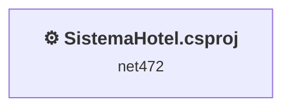
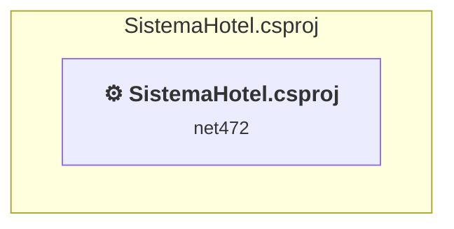

# Projects and dependencies analysis

This document provides a comprehensive overview of the projects and their dependencies in the context of upgrading to .NETCoreApp,Version=v10.0.

## Table of Contents

- [Executive Summary](#executive-Summary)
  - [Highlevel Metrics](#highlevel-metrics)
  - [Projects Compatibility](#projects-compatibility)
  - [Package Compatibility](#package-compatibility)
  - [API Compatibility](#api-compatibility)
  - [Binding Redirect Configuration](#binding-redirect-configuration)
- [Aggregate NuGet packages details](#aggregate-nuget-packages-details)
- [Top API Migration Challenges](#top-api-migration-challenges)
  - [Technologies and Features](#technologies-and-features)
  - [Most Frequent API Issues](#most-frequent-api-issues)
- [Projects Relationship Graph](#projects-relationship-graph)
- [Project Details](#project-details)

  - [SistemaHotel\SistemaHotel.csproj](#sistemahotelsistemahotelcsproj)

## Executive Summary

### Highlevel Metrics

| Metric | Count | Status |
| :--- | :---: | :--- |
| Total Projects | 1 | All require upgrade |
| Total NuGet Packages | 0 | All compatible |
| Total Code Files | 22 |  |
| Total Code Files with Incidents | 22 |  |
| Total Lines of Code | 4276 |  |
| Total Number of Issues | 5881 |  |
| Estimated LOC to modify | 5879+ | at least 137,5% of codebase |

### Projects Compatibility

| Project | Target Framework | Difficulty | Package Issues | API Issues | Binding Issues | Est. LOC Impact | Description |
| :--- | :---: | :---: | :---: | :---: | :---: | :---: | :--- |
| [SistemaHotel\SistemaHotel.csproj](#sistemahotelsistemahotelcsproj) | net472 | 🟡 Medium | 0 | 5879 | 0 | 5879+ | ClassicWinForms, Sdk Style = False |

### Package Compatibility

| Status | Count | Percentage |
| :--- | :---: | :---: |
| ✅ Compatible | 0 | 0,0% |
| ⚠️ Incompatible | 0 | 0,0% |
| 🔄 Upgrade Recommended | 0 | 0,0% |
| ***Total NuGet Packages*** | ***0*** | ***100%*** |

### API Compatibility

| Category | Count | Impact |
| :--- | :---: | :--- |
| 🔴 Binary Incompatible | 5655 | High - Require code changes |
| 🟡 Source Incompatible | 224 | Medium - Needs re-compilation and potential conflicting API error fixing |
| 🔵 Behavioral change | 0 | Low - Behavioral changes that may require testing at runtime |
| ✅ Compatible | 3229 |  |
| ***Total APIs Analyzed*** | ***9108*** |  |

## Aggregate NuGet packages details

| Package | Current Version | Suggested Version | Projects | Description |
| :--- | :---: | :---: | :--- | :--- |

## Top API Migration Challenges

### Technologies and Features

| Technology | Issues | Percentage | Migration Path |
| :--- | :---: | :---: | :--- |
| Windows Forms | 5655 | 96,2% | Windows Forms APIs for building Windows desktop applications with traditional Forms-based UI that are available in .NET on Windows. Enable Windows Desktop support: Option 1 (Recommended): Target net9.0-windows; Option 2: Add <UseWindowsDesktop>true</UseWindowsDesktop>; Option 3 (Legacy): Use Microsoft.NET.Sdk.WindowsDesktop SDK. |
| Windows Forms Legacy Controls | 470 | 8,0% | Legacy Windows Forms controls that have been removed from .NET Core/5+ including StatusBar, DataGrid, ContextMenu, MainMenu, MenuItem, and ToolBar. These controls were replaced by more modern alternatives. Use ToolStrip, MenuStrip, ContextMenuStrip, and DataGridView instead. |
| GDI+ / System.Drawing | 222 | 3,8% | System.Drawing APIs for 2D graphics, imaging, and printing that are available via NuGet package System.Drawing.Common. Note: Not recommended for server scenarios due to Windows dependencies; consider cross-platform alternatives like SkiaSharp or ImageSharp for new code. |
| Legacy Configuration System | 2 | 0,0% | Legacy XML-based configuration system (app.config/web.config) that has been replaced by a more flexible configuration model in .NET Core. The old system was rigid and XML-based. Migrate to Microsoft.Extensions.Configuration with JSON/environment variables; use System.Configuration.ConfigurationManager NuGet package as interim bridge if needed. |

### Most Frequent API Issues

| API | Count | Percentage | Category |
| :--- | :---: | :---: | :--- |
| T:System.Windows.Forms.Button | 638 | 10,9% | Binary Incompatible |
| T:System.Windows.Forms.Label | 484 | 8,2% | Binary Incompatible |
| T:System.Windows.Forms.TextBox | 372 | 6,3% | Binary Incompatible |
| T:System.Windows.Forms.ToolStripMenuItem | 196 | 3,3% | Binary Incompatible |
| P:System.Windows.Forms.Control.Enabled | 191 | 3,2% | Binary Incompatible |
| P:System.Windows.Forms.Control.Name | 137 | 2,3% | Binary Incompatible |
| T:System.Windows.Forms.DataGridView | 135 | 2,3% | Binary Incompatible |
| P:System.Windows.Forms.Control.Location | 129 | 2,2% | Binary Incompatible |
| T:System.Windows.Forms.Control.ControlCollection | 128 | 2,2% | Binary Incompatible |
| P:System.Windows.Forms.Control.Controls | 128 | 2,2% | Binary Incompatible |
| M:System.Windows.Forms.Control.ControlCollection.Add(System.Windows.Forms.Control) | 128 | 2,2% | Binary Incompatible |
| P:System.Windows.Forms.Control.Size | 128 | 2,2% | Binary Incompatible |
| P:System.Windows.Forms.Control.TabIndex | 124 | 2,1% | Binary Incompatible |
| T:System.Windows.Forms.FlatStyle | 105 | 1,8% | Binary Incompatible |
| T:System.Windows.Forms.MessageBoxIcon | 102 | 1,7% | Binary Incompatible |
| T:System.Windows.Forms.MessageBoxButtons | 102 | 1,7% | Binary Incompatible |
| P:System.Windows.Forms.TextBox.Text | 82 | 1,4% | Binary Incompatible |
| T:System.Windows.Forms.Panel | 74 | 1,3% | Binary Incompatible |
| T:System.Windows.Forms.FlatButtonAppearance | 71 | 1,2% | Binary Incompatible |
| P:System.Windows.Forms.ButtonBase.FlatAppearance | 71 | 1,2% | Binary Incompatible |
| T:System.Windows.Forms.DialogResult | 69 | 1,2% | Binary Incompatible |
| T:System.Windows.Forms.Cursor | 68 | 1,2% | Binary Incompatible |
| T:System.Windows.Forms.MaskedTextBox | 68 | 1,2% | Binary Incompatible |
| T:System.Windows.Forms.ComboBox | 54 | 0,9% | Binary Incompatible |
| T:System.Windows.Forms.MessageBox | 54 | 0,9% | Binary Incompatible |
| T:System.Windows.Forms.PictureBox | 53 | 0,9% | Binary Incompatible |
| M:System.Windows.Forms.MessageBox.Show(System.String,System.String,System.Windows.Forms.MessageBoxButtons,System.Windows.Forms.MessageBoxIcon) | 51 | 0,9% | Binary Incompatible |
| P:System.Windows.Forms.Label.Text | 47 | 0,8% | Binary Incompatible |
| F:System.Windows.Forms.MessageBoxButtons.OK | 45 | 0,8% | Binary Incompatible |
| T:System.Drawing.Image | 45 | 0,8% | Source Incompatible |
| P:System.Windows.Forms.Label.AutoSize | 45 | 0,8% | Binary Incompatible |
| M:System.Windows.Forms.Label.#ctor | 45 | 0,8% | Binary Incompatible |
| F:System.Windows.Forms.MessageBoxIcon.Information | 40 | 0,7% | Binary Incompatible |
| T:System.Drawing.GraphicsUnit | 38 | 0,6% | Source Incompatible |
| T:System.Drawing.FontStyle | 38 | 0,6% | Source Incompatible |
| T:System.Drawing.Font | 38 | 0,6% | Source Incompatible |
| P:System.Windows.Forms.ButtonBase.UseVisualStyleBackColor | 37 | 0,6% | Binary Incompatible |
| P:System.Windows.Forms.ButtonBase.FlatStyle | 35 | 0,6% | Binary Incompatible |
| M:System.Windows.Forms.Button.#ctor | 35 | 0,6% | Binary Incompatible |
| F:System.Windows.Forms.FlatStyle.Flat | 34 | 0,6% | Binary Incompatible |
| P:System.Windows.Forms.FlatButtonAppearance.MouseOverBackColor | 34 | 0,6% | Binary Incompatible |
| T:System.Windows.Forms.Cursors | 34 | 0,6% | Binary Incompatible |
| P:System.Windows.Forms.Cursors.Hand | 34 | 0,6% | Binary Incompatible |
| P:System.Windows.Forms.Control.Cursor | 34 | 0,6% | Binary Incompatible |
| M:System.Windows.Forms.Control.Focus | 33 | 0,6% | Binary Incompatible |
| P:System.Windows.Forms.FlatButtonAppearance.BorderSize | 33 | 0,6% | Binary Incompatible |
| P:System.Windows.Forms.ButtonBase.Image | 32 | 0,5% | Binary Incompatible |
| T:System.Windows.Forms.DataGridViewRow | 31 | 0,5% | Binary Incompatible |
| P:System.Windows.Forms.DataGridView.CurrentRow | 31 | 0,5% | Binary Incompatible |
| T:System.Windows.Forms.DataGridViewCellCollection | 31 | 0,5% | Binary Incompatible |

## Projects Relationship Graph

Legend:
📦 SDK-style project
⚙️ Classic project

## Project Details

### SistemaHotel\SistemaHotel.csproj

#### Project Info

- **Current Target Framework:** net472
- **Proposed Target Framework:** net10.0-windows
- **SDK-style**: False
- **Project Kind:** ClassicWinForms
- **Dependencies**: 0
- **Dependants**: 0
- **Number of Files**: 33
- **Number of Files with Incidents**: 22
- **Lines of Code**: 4276
- **Estimated LOC to modify**: 5879+ (at least 137,5% of the project)

#### Dependency Graph

Legend:
📦 SDK-style project
⚙️ Classic project

### API Compatibility

| Category | Count | Impact |
| :--- | :---: | :--- |
| 🔴 Binary Incompatible | 5655 | High - Require code changes |
| 🟡 Source Incompatible | 224 | Medium - Needs re-compilation and potential conflicting API error fixing |
| 🔵 Behavioral change | 0 | Low - Behavioral changes that may require testing at runtime |
| ✅ Compatible | 3229 |  |
| ***Total APIs Analyzed*** | ***9108*** |  |

#### Project Technologies and Features

| Technology | Issues | Percentage | Migration Path |
| :--- | :---: | :---: | :--- |
| Legacy Configuration System | 2 | 0,0% | Legacy XML-based configuration system (app.config/web.config) that has been replaced by a more flexible configuration model in .NET Core. The old system was rigid and XML-based. Migrate to Microsoft.Extensions.Configuration with JSON/environment variables; use System.Configuration.ConfigurationManager NuGet package as interim bridge if needed. |
| Windows Forms Legacy Controls | 470 | 8,0% | Legacy Windows Forms controls that have been removed from .NET Core/5+ including StatusBar, DataGrid, ContextMenu, MainMenu, MenuItem, and ToolBar. These controls were replaced by more modern alternatives. Use ToolStrip, MenuStrip, ContextMenuStrip, and DataGridView instead. |
| GDI+ / System.Drawing | 222 | 3,8% | System.Drawing APIs for 2D graphics, imaging, and printing that are available via NuGet package System.Drawing.Common. Note: Not recommended for server scenarios due to Windows dependencies; consider cross-platform alternatives like SkiaSharp or ImageSharp for new code. |
| Windows Forms | 5655 | 96,2% | Windows Forms APIs for building Windows desktop applications with traditional Forms-based UI that are available in .NET on Windows. Enable Windows Desktop support: Option 1 (Recommended): Target net9.0-windows; Option 2: Add <UseWindowsDesktop>true</UseWindowsDesktop>; Option 3 (Legacy): Use Microsoft.NET.Sdk.WindowsDesktop SDK. |

